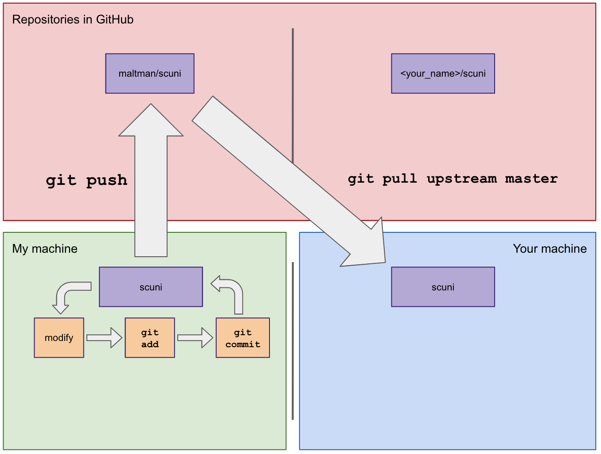

# git

Git is a distributed version control system! It allows developers to track changes to their code.

If you're new to git, here are some resources:

[Git-Book](https://git-scm.com/book/en/v2) is a really good read with lots of diagrams. I highly
recommend you read the following sections:
1. Git Basics
2. Git Branching
3. GitHub - Contributing to a project

[Forking Git Repositories](https://guides.github.com/activities/forking/) specifically explains
the GitHub model of code collaboration. This is the model we will use for these exercises.

# Let's make some changes

Based on what you learned from the links above, go through the following steps:
## 1. fork this repository (mikasaurus/mikuni)
`mikasaurus/mikuni` is a repository that I own. Only I can push changes directly to it.
You'll need your own copy of the repository in GitHub.

To make your own copy in GitHub, you need to fork my repository using the
GitHub web interface.

You'll now have a `<your_name>/mikuni` repository in GitHub that you own. The
changes you push end up here.

## 2. clone your forked repository onto your working computer
Because `<your_name>/mikuni` is a repository in GitHub, it is a `remote` repository.
People generally work on their own local repository. Cloning allows you to copy
your remote repository to your local machine.

`git clone <url>`

## 3. create a feature branch on your local repository
Before starting any implementation work, create a feature branch.

Feature branches allow you to isolate specific feature work. This prevents
changes in the main branch, `master`, from affecting or colliding with
your feature development.

`git branch assignment1`

That creates the branch. You'll then have to switch to it.

`git checkout assignment1`

Now, all your commits for assignment 1 will be placed on this branch.

`git branch` will show you your branches and indicate the current
branch with an asterisk.

As people complete assignments, I will be merging their work into the
`master` branch on my GitHub repository. If you also did your work
in your local `master` branch, syncing my changes to yours would be
messy.

By using a feature branch, you can sync your local repository
without incurring conflicts or messing up your commit chain for future
pull requests.

When you're done with your feature branch, and it's been merged into
my GitHub repo, you can delete it. Then make a new one for the next
assignment.

## 4. create a text file in the `work` subdirectory and answer a few questions
Use your favorite text editor (all the cool kids use Vim) to answer the questions
in a text file called `<your_name>.txt` in the `work` directory for this exercise.

### TODO: Answer these questions

See my answers in `./work` if you need an example.

1. What's your name?

2. What's your experience with coding / scripting?

3. What languages have you used before?

4. What's your experience with the Linux command line?

5. What text editor are you using to answer these?

6. What's your favorite funny gif these days?

## 5. commit your modifications to your local repository
`git status` is the basic command to show you the status of your working repo.

Git has two "areas" that changes can exist in: modified and staged.  Modified
files are simply files that have been changed. To get files and changes ready
to be committed, you must *stage* them.

`git add <file_name>` or `git add -u` will stage a file or all modified files respectively.

You can then commit the changes that are staged.

`git commit`

## 6. push your local changes to your remote repository (the one you forked on github)
By committing your changes, you created a new commit on your *local* repo. You'll
want to push this change to your *remote* repo.

`git push`

## 7. open a pull request to show me your answers!
The pull request is an indication to me (the original repo owner) that you
have changes that you'd like to bring into my repo.

Note that a pull request is not a `git` command. (Not to be confused
with `git pull`, which is a `git` specific command.) Pull requests are
the mechanism that GitHub (and other sites, like BitBucket) use to
facilitate many people working on a repository at once. You create a
pull request through the GitHub user interface, by clicking the *New
pull request* button while viewing your remote repository.

# Keeping your local repository synced with mine

I'll be pushing up changes to the exercises as I get feedback from people
and as new assignments are created. Also, other people will doing pull requests
to incorporate their work into the main repository.

Because of this, after your initial fork and clone, your `mikuni` repository will
become outdated.

To keep it in sync, you'll have to add my GitHub `mikuni` repository as another
remote repository for your local copy. Currently, the only remote repository your
local copy knows about is your GitHub repo `<your_name>/mikuni`. This remote is called
`origin`.

You can see your remote repositories with this command:

`git remote -v`

Initially, this will only show your `origin` remote repository. (This is your remote
repo you forked in GitHub.)

Add my repository as a new remote repository called `upstream`.

`git remote add upstream https://github.lab.local/mikasaurus/mikuni.git`

Now, `mikasaurus/mikuni` is a *second* remote repository, you'll be
able to `pull` changes from `mikasaurus/mikuni` into your local repository.

This diagram shows what's happening.

Now, when there's something new in `mikasaurus/mikuni`, you can bring it into
your local repository with the following command:

`git pull upstream master`

Pulling from my GitHub repo will bring changes into your local repo, and may sometimes
result in merge conflicts. These require your manual intervention to resolve. Once
they are resolved, you will be in sync with my version of the repo. (Any changes
you made while you were working will still be there.)

Also note that this process only updates your local repository. You'll have to
push like before to get those changes into your initial `origin` repository.

It's a good idea to run `git pull upstream master` before starting each
assignment to ensure you have the most up to date instructions.
