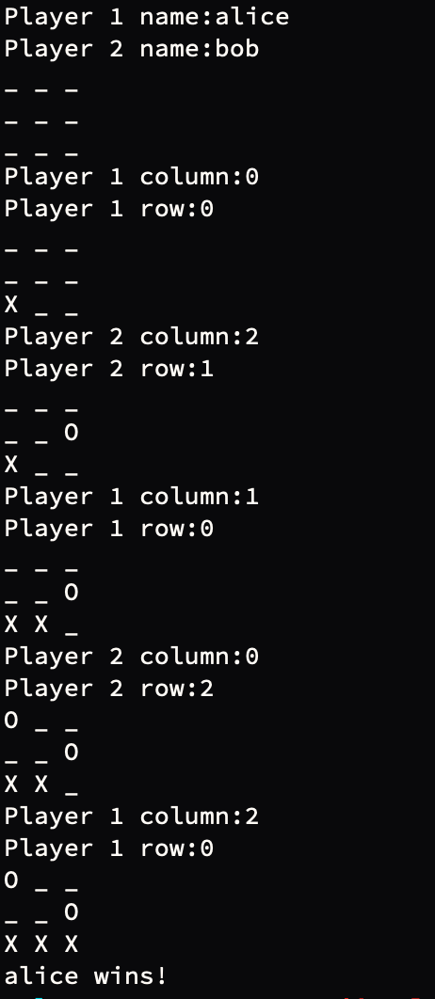

# TicTacToe
Let's use Python to make a TicTacToe game!

In this exercise, we'll walk through some design thinking and you'll take care of the implementation.

## Design
Code design is an important part of the process for making correct, efficient, and maintainable code.
I'll walk you through the design step in this exercise to provide you with an example of how
to approach a problem.

### What distinguishes a good design or architecture from bad?
Generally, well designed code separates responsibilities into easy to understand modules.
A coding solution can break down a complex problem into smaller pieces, which are more
easy to manage and modify. Although the pieces interact with each other, changing one piece
should be easy and should not significantly affect the other pieces. It's also easier to
test and verify each small piece.

On the other hand, poorly designed code is difficult to understand. Instead of being composed
of a number of small modules, it is a huge monolith. Changing one piece of code is difficult
because it breaks everything around it. It was coded with strong assumptions, and breaking
any of those assumptions would necessitate rewriting a large amount of code.

Breaking down complex problems into smaller ones is a common theme in software
development. There are many ways to code a solution to a problem, which may
make determining the best design difficult. Having said that, don't be afraid
to write poorly designed code. One of the best ways to learn why a design is
bad is to use it, run into a bunch of issues, and understand the underlying
causes.

### Where do we begin?
So we have to make TicTacToe with Python. There's a lot that has to happen to go from this
initial step to working code that implements TicTacToe.

**It's OK not to know all the steps right away.**

This is where you start practicing breaking problems down into smaller pieces.

### Break down the problem
(This might get a little pedantic, but let's go through it.)

#### 1. What are we trying to do?

Make a TicTacToe game!

#### 2. To implement TicTacToe, we need to know how the game is played. How do we play TicTacToe?

(For those who don't know, the rules are summarized in the first paragraph of this
[wikipedia article](https://en.wikipedia.org/wiki/Tic-tac-toe).)

To summarize:

    - there's a 3x3 grid

    - there are 2 players

    - players take turns placing Xs or Os in each cell

    - the player who places 3 markers in a horizontal, vertical, or diagonal row wins

    - the game can end in a draw if all spaces fill up

#### 3. Great. How do we transition this knowledge to begin coding?

Python is an object oriented programming language. We can use classes to represent various
parts of the game. We want to think about what classes we'll need and explicitly state their
responsibilities. We're not thinking about the implementation yet.

First, we'll need a class to represent the grid. Let's call this `GameBoard`.
It has to keep track of where players put their Xs and Os, and it will know when
the winning condition is met. It also has to print the grid out, so players
can see where they're placing their markers.

Second, we'll need a class to represent a player. Let's call this `Player`. A player
will have a name, and a marker (X or O).

Up until now, the classes correspond to the nouns in our game summary. We have a game
board and we have players. These are naturally represented as classes in Python. We can
make as many objects from those classes as necessary. 1 game board and 2 players.

However, **abstract concepts or actions** can also be represented with classes. In this
example, we need something that represents the **game loop**. This class is responsible
for providing the players their turns, getting the players' input, and displaying the
current state of the TicTacToe grid. Call this `GameLoop`.

So now, we've broken down the whole game into 3 separate building blocks.

## Start implementing your building blocks
### 1. Copy the template `tictactoe.py` file to `./work` and rename it to `<your_name>_tictactoe.py`

### 2. Let's implement the `Player` class.

A Player needs a name and a marker. It may need more stuff eventually, but
since this class represents a player, we can easily add stuff to it without
affecting the other classes.

**TODO**: implement the `Player` class

### 3. Implement the `GameBoard` class.

The `GameBoard` has to represent our grid. There are a number of ways to do this. We
have to make a design decision! Let's consider our options.

Since the grid is 3x3, there are 9 total spaces. We could create 9 variables, one
for each cell and modify those directly. This would make this simpler to implement
but it would be harder to scale. If a requirement came in later to use a 10x10 grid
instead of a 3x3 grid, using this design would be tedious and error prone.

Another option is to use a 2 dimensional list. We'd provide the dimensions in
the beginning of the game. Accessing individual cells in the grid would be done
by indexing into this array with a column and row value. This will make the coding
slightly more complex. But, if we want a variable grid size, this solution will
accomodate that much more easily.

For this exercise, we'll focus on a 3x3 grid. So, choose either of the 2 designs above
or use anything else that comes to mind. (If you choose something else, write a few
sentences on the strengths and weaknesses of your design.)

**TODO**: implement the `GameBoard` class

**Note: You don't have to implement the whole class at this point. It's totally OK
to implement the grid and a basic print function, and come back to it when realize
what other things it is responsible for.**

### 4. Implement the `GameLoop` class.

The `GameLoop` is responsible for running the game. That means that it will create
the `GameBoard` object and the `Player` objects.

After that, it will have the players enter their marker location. Every language
has a different syntax for getting user input. This is an example of an easily
googleable solution.

After a player inputs their marker location, it will place the marker on the board,
and print the board.

After each player's turn, `GameLoop` should check if that player won. But
remember, the `GameBoard` has that knowledge because it keeps track of the
board and markers! This sounds like a perfect use of a class member function
for `GameBoard`. In situations like this, `GameLoop` would invoke that function
on its `GameBoard` object. If some player has won, `GameLoop` should print
a message saying so with that player's name.

It should also check for tie games after each player's turn.

All of the steps above, except for initializing the objects, should be ran
in some loop until the game ends.

Ultimately, the only thing the main program should do is create a `GameLoop`
object and invoke some `play()` method on that object. All other logic
should be placed inside their corresponding building block, or component.

**TODO**: implement the `GameLoop` class

## Example game output

